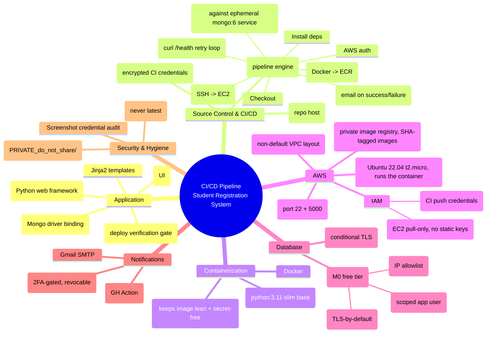

# Tech Stack & Mind Map — Quick Revision Reference

Fast-recall reference for this project. Read [`01_PROJECT_JOURNAL.md`](./01_PROJECT_JOURNAL.md) first for the "why"; this doc is the "what" — for skimming before an interview or a future rebuild.

---

## 1. Mind map — how the pieces connect



---

## 2. Tech stack table

| Layer | Technology | Role |
|---|---|---|
| Language | Python 3.11 | App + tests |
| Web framework | Flask | HTTP routing, templating |
| DB driver | Flask-PyMongo / PyMongo | MongoDB access from Flask |
| TLS | certifi | CA bundle for Atlas TLS connections |
| Templating | Jinja2 | Server-rendered HTML |
| CSS framework | Bootstrap 5 | Styling, forms, layout |
| Database | MongoDB Atlas (M0) | Persistent storage, managed/hosted |
| Containerization | Docker | Packaging the app as a portable image |
| Image registry | Amazon ECR | Private, versioned image storage |
| Compute | Amazon EC2 (Ubuntu 22.04, t2.micro) | Runs the container in production |
| IAM | AWS IAM (user + instance role) | Access control for CI and for the EC2 host |
| CI/CD engine | GitHub Actions | Orchestrates test → build → push → deploy → verify → notify |
| Deploy transport | SSH (`appleboy/ssh-action`) | Runner → EC2 command execution |
| Notifications | Gmail SMTP (`dawidd6/action-send-mail`) | Success/failure email alerts |
| Secrets storage | GitHub Actions Secrets | AWS keys, SSH key, Mongo URI, email creds |
| Version control | Git + GitHub | Source of truth, triggers the pipeline |

---

## 3. The pipeline, left to right

```
push to main
   │
   ▼
[1 Checkout] → [2 Install deps] → [3 Test (mongo:6 service)]
   │                                      │ pass
   ▼                                      ▼
                                   [4 AWS creds] → [5 Build & Push image → ECR]
                                                          │
                                                          ▼
                                                  [6 Deploy — SSH to EC2,
                                                   docker pull + run new tag]
                                                          │
                                                          ▼
                                                  [7 Verify — curl /health,
                                                   retry until 200 OK]
                                                          │
                                          ┌───────────────┴───────────────┐
                                          ▼                               ▼
                                   [8a Success email]              [8b Failure email
                                                                     w/ failed-stage name]
```

**Key design decisions to remember:**
1. **Test before build** — never build/push/deploy code that fails its own test suite.
2. **Tag by commit SHA, not `latest`** — the tag is the audit trail.
3. **IAM instance role on EC2, IAM user for CI** — the server never holds long-lived static credentials; only the CI runner does (and those live in encrypted GitHub secrets).
4. **`/health` is the real deploy gate**, not "SSH command exited 0" — a container can start and still be broken.
5. **Conditional TLS in PyMongo** — same `app.py` works against both a non-TLS CI database and a TLS-required Atlas cluster.

---

## 4. Concepts worth re-explaining to yourself from scratch

Use these as self-quiz prompts next time you revisit this project:

- **Why does the Docker build COPY `requirements.txt` before the rest of the source?** → layer caching; dependency installs are slow and shouldn't re-run on every code change.
- **Why an IAM *role* on the EC2 instance instead of an IAM *user* with access keys?** → roles issue short-lived, auto-rotated credentials via the instance metadata service; no secret ever sits on disk on the box.
- **Why is the image tagged by git SHA?** → traceability — you can always answer "which commit is actually running?" by inspecting the running container's tag.
- **Why `mongodb+srv://` instead of a plain `mongodb://` connection string for Atlas?** → SRV records let the driver auto-discover the replica set members and enforce TLS by default, without you hardcoding a list of hosts.
- **Why did the test stage need its own throwaway MongoDB, instead of pointing tests at the real Atlas cluster?** → isolation (tests shouldn't be able to corrupt real data) and speed/reliability (no network dependency, no risk of hitting Atlas's IP allowlist from a GitHub-hosted runner with an unpredictable IP).
- **Why Gmail App Password instead of the real account password?** → least privilege + revocability — an app password can be individually killed without changing your actual login credential, and Gmail requires 2FA to be enabled first as a baseline security gate.
- **Why does `.gitignore` alone not fully "delete" the risk of a secret that already sits in the working tree?** → `.gitignore` only prevents *future* tracking; it does nothing for a secret that was ever committed in the past, and it doesn't stop a human from manually `git add -f`-ing the file. It's a guardrail, not a guarantee — the real fix for an *exposed* credential (e.g. one visible in a screenshot) is rotation.
